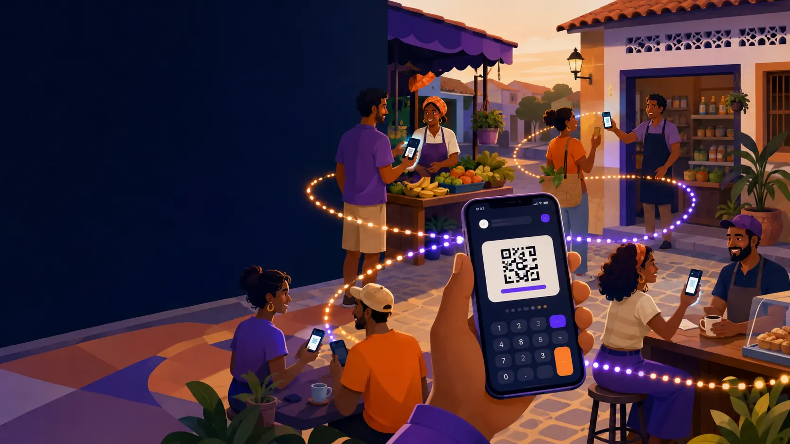
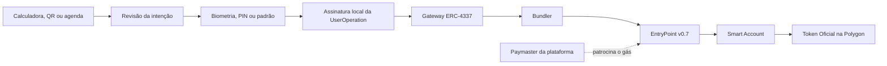

<div align="center">
  

  <h1>Meu Dinheiro</h1>
  <p><strong>Fortalece minha região</strong></p>
  <p>
    Carteira Web3 Android para pagamentos locais na Polygon,<br>
    com a simplicidade de uma calculadora e segurança por padrão.
  </p>

  <a href="https://rapporttecnologia.github.io/meudinheiro/"><strong>Conhecer o projeto</strong></a>
  ·
  <a href="docs/REQUIREMENTS.md">Requisitos</a>
  ·
  <a href="docs/ARCHITECTURE.md">Arquitetura</a>
  ·
  <a href="docs/USE_CASES.md">Casos de uso</a>
  ·
  <a href="docs/ACCOUNT_ABSTRACTION.md">Custo zero</a>
  <br><br>

  <a href="https://github.com/RapportTecnologia/meudinheiro/stargazers"></a>
  <a href="https://github.com/RapportTecnologia/meudinheiro/network/members"></a>
  <a href="https://github.com/RapportTecnologia/meudinheiro/issues"></a>
  <a href="https://github.com/RapportTecnologia/meudinheiro/commits/main"></a>
  
  
  
  <br>
  
  
  
  
  
  
  <a href="https://github.com/RapportTecnologia/meudinheiro/actions/workflows/jekyll-gh-pages.yml"></a>
</div>

<br>



> [!IMPORTANT]
> O **Meu Dinheiro** é uma base de engenharia em desenvolvimento. Ainda não está pronto para custodiar ou movimentar fundos reais. Produção exige contratos e serviços implantados, auditoria independente, testes de integração, threat model, política de privacidade e homologação completa na Polygon.

## Visão do produto

O **Meu Dinheiro** aproxima pessoas, pequenos negócios e serviços da mesma região por meio de uma experiência familiar: a tela principal funciona como uma calculadora. O valor digitado ou calculado torna-se uma **intenção de pagamento**, nunca uma transferência automática.

Antes de qualquer movimentação, o aplicativo apresenta token, cotação, quantidade, endereço completo, rede e patrocinador do gás. O usuário revisa esses dados e autoriza a operação com biometria, PIN ou padrão do dispositivo.

O produto combina quatro princípios:

| Princípio | Como aparece no aplicativo |
| --- | --- |
| **Simples para usar** | Calculadora funcional, QR Code, agenda e compartilhamento pelo clipboard |
| **Local por propósito** | Pagamentos entre moradores, comerciantes e serviços da mesma região |
| **Autocustodial** | A chave permanece protegida no dispositivo; o backend nunca a recebe |
| **Seguro por padrão** | Revisão explícita, autenticação local e validação defensiva da operação |

## A experiência em quatro passos

```text
1. CALCULE          2. ESCOLHA          3. CONFIRA          4. AUTORIZE
Valor em BRL    ->  QR, agenda ou   ->  token, destino, ->  biometria, PIN
ou no Token         solicitação         cotação e gás       ou padrão
Oficial              copiada             patrocinado
```

A calculadora prepara o valor. O QR Code ou a agenda resolve o destinatário. A tela de revisão valida todos os dados. Somente depois disso a autenticação local libera a assinatura da `UserOperation`.

## Principais recursos

- **Calculadora funcional:** soma, subtração, multiplicação e divisão por parser restrito.
- **Até duas contas:** duas EOAs proprietárias, cada uma vinculada à sua Smart Account ERC-4337.
- **Token Oficial:** único ERC-20 usado nos pagamentos comuns do aplicativo.
- **Entrada em reais:** o valor em BRL é convertido para o Token Oficial por cotação identificada e com prazo de validade.
- **Enviar e receber:** solicitações interoperáveis por QR Code no padrão EIP-681.
- **Agenda segura:** favoritos, frequência, recência e proteção contra nomes ou endereços duplicados.
- **Clipboard:** compartilhamento de destino e valor proposto sem autorizar automaticamente a transferência.
- **Autenticação obrigatória:** biometria, PIN ou padrão para toda operação sensível.
- **Custo zero para o usuário:** o Paymaster paga o gás elegível em POL por Account Abstraction.
- **Modo comerciante:** fluxo separado para administração de estoque e conversão Token Oficial ↔ POL.

## Casos de uso regionais

| Situação | Jornada resumida |
| --- | --- |
| **Abastecer a carteira** | O usuário informa o valor, exibe seu QR e recebe o Token Oficial de um comerciante |
| **Pagar uma compra** | O caixa gera uma cobrança com valor; o usuário lê, revisa e autoriza |
| **Transferir para um amigo** | O emissor calcula o valor e lê o QR ou a solicitação compartilhada pelo destinatário |
| **Solicitar um pagamento** | O recebedor compartilha endereço e valor proposto por QR ou área de transferência |
| **Reutilizar contatos** | Destinatários frequentes ficam na agenda após confirmação e validação de conflitos |

Em todos os fluxos, QR Code, clipboard e agenda são apenas fontes de dados não confiáveis. Eles nunca acessam a chave nem autorizam sozinhos uma movimentação.

## Token Oficial e valores em reais

Toda transferência comum acontece no **Token Oficial Meu Dinheiro** da região. Quando o usuário escolhe BRL, o aplicativo não envia reais para a blockchain: ele consulta uma cotação vigente e calcula a quantidade equivalente do ERC-20 em unidades mínimas.

A cotação deve informar fonte, horário, validade e evidência de integridade. Se estiver ausente, expirada ou divergente, a transação é bloqueada. O projeto não apresenta o token como investimento, não promete valorização e não garante liquidez.

Comerciantes atuam como pontos regionais de circulação e abastecimento. O swap de estoque é uma função comercial separada; usuários comuns apenas enviam e recebem o Token Oficial.

Detalhes: [modelo econômico, cotação e gás](docs/ECONOMIC_MODEL.md).

## Custo zero com Account Abstraction

“Custo zero” significa que **nenhum POL é debitado do usuário em uma transferência patrocinada**. A Polygon continua cobrando gás, mas o custo é pago pelo depósito da plataforma no EntryPoint por meio do Paymaster.



O aplicativo confere localmente Smart Account, EntryPoint, Paymaster, token, destinatário, quantidade, validade, hash e limites de gás antes de assinar. Se o patrocínio falhar, a operação é bloqueada; não existe fallback silencioso para cobrar POL do usuário.

Detalhes: [Account Abstraction, Smart Account e Paymaster](docs/ACCOUNT_ABSTRACTION.md).

## Arquitetura

O código segue **DDD pragmático** e separa regras de negócio, casos de uso, integrações e interface:

```text
src/
├── domain/           entidades, value objects e invariantes puras
├── application/      casos de uso, hooks e portas
├── infrastructure/   RPC, Gateway ERC-4337, contratos, storage e autenticação
└── presentation/     componentes, navegação e telas

__tests__/             testes de domínio e aplicação
docs/                  requisitos, arquitetura e regras operacionais
site/                  site institucional Jekyll e ativos da marca
```

A direção das dependências é:

```text
presentation -> application -> domain
                      ^
                      |
               infrastructure
```

A infraestrutura implementa as portas definidas pela aplicação. Regras financeiras e de segurança permanecem testáveis sem câmera, RPC ou blockchain.

## Tecnologias

| Área | Tecnologia |
| --- | --- |
| Aplicativo | React Native 0.86 + Expo 57 + TypeScript |
| Blockchain | Polygon PoS, ethers.js 6 e ERC-20 |
| Conta operacional | ERC-4337, Smart Account e EntryPoint v0.7 |
| Estado | Zustand + AsyncStorage somente para dados públicos |
| Segredos | Expo SecureStore |
| Autenticação | Expo Local Authentication |
| QR Code | Expo Camera + EIP-681 + react-native-qrcode-svg |
| Navegação | React Navigation |
| Testes | Jest, jest-expo e Testing Library |
| Site | Jekyll + GitHub Pages |

## Estado da implementação

| Área | Estado atual |
| --- | --- |
| Calculadora e organização DDD | Base implementada |
| Contas, armazenamento seguro e autenticação | Base implementada; exige teste em development build |
| Scanner, QR EIP-681, agenda e clipboard | Domínio e fluxos preparados |
| Cliente do Gateway ERC-4337 | Contrato HTTP e validações locais implementados |
| Smart Account Factory e Paymaster | Contratos e operação precisam ser implantados e auditados |
| Gateway, Bundler e signer em KMS/HSM | Backend ainda necessário para operação real |
| Cotação Token Oficial/BRL | Provider de produção pendente |
| Swap comercial | Desabilitado por padrão com `swapEnabled: false` |
| Polygon mainnet | Não homologada para fundos reais |

## Começando

### Pré-requisitos

- Node.js LTS compatível com Expo 57;
- npm;
- Android Studio, SDK Android e dispositivo/emulador para development build;
- endpoint RPC Polygon para desenvolvimento.

### Instalação

```bash
git clone https://github.com/RapportTecnologia/meudinheiro.git
cd meudinheiro
npm ci
cp .env.example .env
npm test
npm run typecheck
npx expo start
```

Para testar SecureStore, câmera e autenticação com comportamento Android completo:

```bash
npx expo prebuild
npx expo run:android
```

### Variáveis de ambiente

| Variável | Finalidade |
| --- | --- |
| `EXPO_PUBLIC_POLYGON_RPC_URL` | RPC da Polygon PoS |
| `EXPO_PUBLIC_ERC4337_GATEWAY_URL` | endpoint público do Gateway da plataforma |
| `EXPO_PUBLIC_ERC4337_ENTRY_POINT` | endereço esperado do EntryPoint v0.7 |
| `EXPO_PUBLIC_ERC4337_SIMPLE_ACCOUNT_FACTORY` | factory auditada da Smart Account |

> [!CAUTION]
> Variáveis `EXPO_PUBLIC_*` fazem parte do aplicativo distribuído. Nunca coloque nelas chave privada, seed, credencial de Bundler, chave do sponsor, token administrativo ou segredo RPC.

## Segurança

- Chaves privadas nunca entram em AsyncStorage, Zustand, logs, telemetria ou commits.
- A chave é armazenada por referência no SecureStore e usada apenas após autenticação.
- O Gateway recebe assinatura, nunca seed ou chave privada.
- Valores on-chain usam `bigint` e `parseUnits`; nunca `number`.
- Rede, contrato, código, destinatário, cotação e hash são conferidos antes da assinatura.
- QR Code e clipboard são tratados como entrada externa não confiável.
- Toque duplo, replay, cotação expirada e operação divergente devem ser bloqueados.
- Credenciais de Bundler/Paymaster e chave de patrocínio pertencem ao backend/KMS.
- Envio e swap permanecem bloqueados quando a configuração oficial não pode ser validada.

Leia a [arquitetura de segurança](docs/ARCHITECTURE.md) e a [política ERC-4337](docs/ACCOUNT_ABSTRACTION.md) antes de implementar integrações financeiras.

## Documentação

| Documento | Conteúdo |
| --- | --- |
| [Requisitos](docs/REQUIREMENTS.md) | regras funcionais, não funcionais e critérios de aceite |
| [Arquitetura](docs/ARCHITECTURE.md) | camadas, fluxos, decisões técnicas e pendências |
| [Casos de uso](docs/USE_CASES.md) | abastecimento, compra, cobrança e transferência |
| [Modelo econômico](docs/ECONOMIC_MODEL.md) | Token Oficial, cotação em BRL, comerciantes e gás |
| [Account Abstraction](docs/ACCOUNT_ABSTRACTION.md) | Smart Account, Gateway, Bundler e Paymaster |
| [Agenda e compartilhamento](docs/CONTACTS_AND_SHARING.md) | contatos, conflitos, QR e clipboard |
| [Identidade de marca](docs/BRAND.md) | posicionamento, símbolo, paleta e tom de voz |
| [Site e publicação](docs/SITE.md) | Jekyll, GitHub Pages e workflow oficial |

A documentação também está disponível no site público:

**[rapporttecnologia.github.io/meudinheiro](https://rapporttecnologia.github.io/meudinheiro/)**

## Desenvolvimento orientado a testes

A sequência recomendada por feature é:

1. escrever o teste da regra de domínio;
2. implementar a menor solução que satisfaz a regra;
3. testar o caso de uso com portas falsas;
4. integrar infraestrutura em Amoy ou fork;
5. testar o componente React Native;
6. validar o fluxo E2E em development build.

Casos mínimos incluem limite de duas contas, parser de pagamento, conflito de contatos, QR inválido, chainId incorreto, autenticação cancelada, cotação expirada, hash divergente e envio duplicado.

## Como contribuir

1. consulte os [requisitos](docs/REQUIREMENTS.md) e a [arquitetura](docs/ARCHITECTURE.md);
2. abra uma issue descrevendo problema, risco e critério de aceite;
3. mantenha regras no domínio e integrações atrás de portas;
4. inclua testes para toda mudança de comportamento;
5. nunca envie segredos, endereços administrativos não aprovados ou dados pessoais.

Sugestões, relatórios de erro e propostas de melhoria são bem-vindos em [GitHub Issues](https://github.com/RapportTecnologia/meudinheiro/issues).

---

<div align="center">
  
  <p><strong>Meu Dinheiro — Fortalece minha região</strong></p>
  <p>Um projeto da <a href="https://rapport.tec.br">Rapport Tecnologia e Inovação</a>.</p>
  <sub>Documento do projeto · versão 0.1.0 · atualizado em julho de 2026</sub>
</div>
